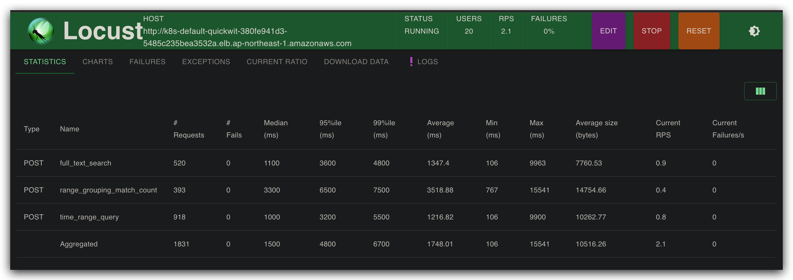

# quickwit-benchmark

quickwit-benchmark是一个使用Locust进行性能压力测试的项目,旨在测试quickwit日志系统的查询性能。

## 运行环境

- Python 3.11.6

## 依赖项

- locustio==0.999
- loguru==0.7.2

## 使用方法

1. 克隆项目仓库

```
git clone https://github.com/neosun100/quickwit-benchmark.git
```

2. 安装依赖项

```
pip install -r requirements.txt
```

3. 设置测试参数

```
export TARGET_HOST=http://your-test-host.com
export START_TIME=2024-03-30T00:00:00
export END_TIME=2024-04-02T01:59:59
```

4. 启动Locust

```
locust -f benchmark.py
```

5. 在Locust Web UI中配置desired_total_user_count和spawn_rate参数,开始测试。

## Dockerfile

```dockerfile
FROM python:3.11

WORKDIR /app

COPY . /app

RUN pip install --no-cache-dir -r requirements.txt

ENTRYPOINT ["locust", "-f", "benchmark.py"]
```

使用方法:

```
docker build -t quickwit-benchmark .
docker image prune 
docker run -it -p 8089:8089 -e TARGET_HOST=http://your-test-host.com -e START_TIME=2024-03-30T00:00:00 -e END_TIME=2024-04-02T01:59:59 quickwit-benchmark
```

## 测试截图


## 项目说明

本项目使用Locust框架模拟多个并发用户向quickwit日志系统发送不同类型的查询请求,测试系统在高并发场景下的响应延迟和吞吐量等性能指标。测试脚本中包含了时间范围查询、全文搜索查询和按时间段分组统计查询等多种查询场景。


